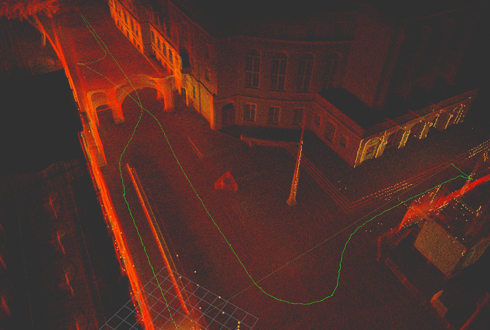
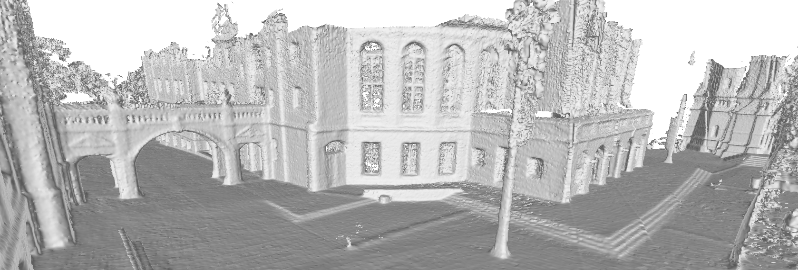
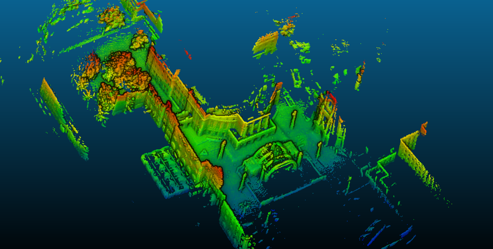
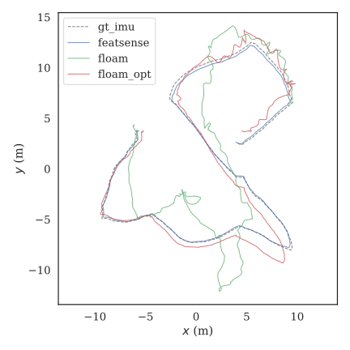
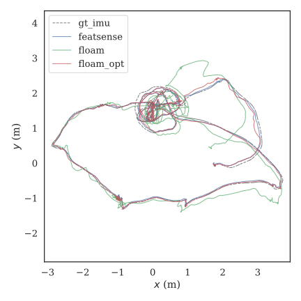
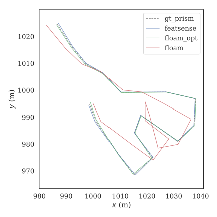
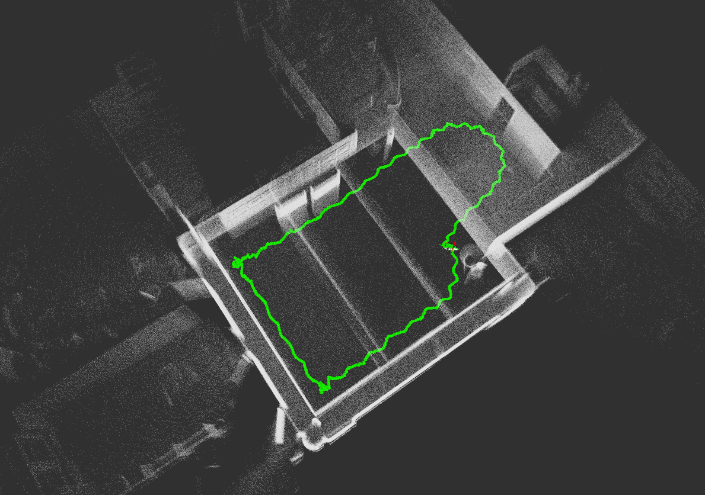
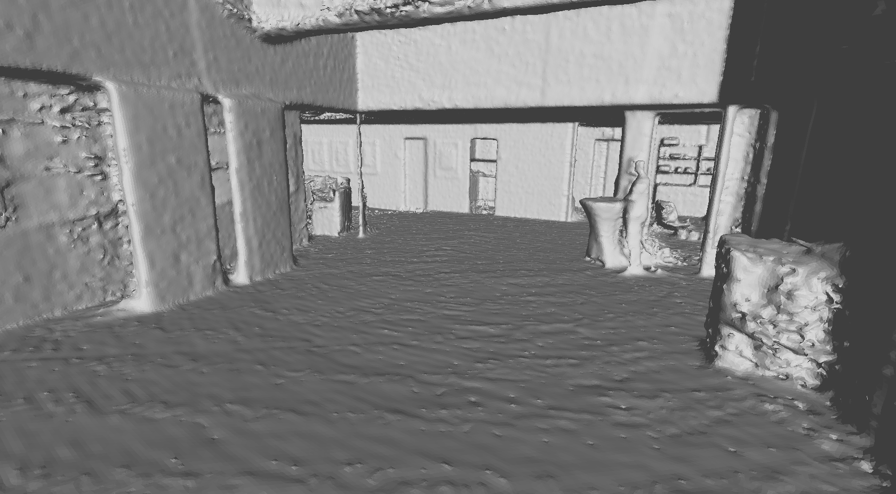

# Warpsense

```
@misc{gaal2023featsense,
      title={FeatSense -- A Feature-based Registration Algorithm with GPU-accelerated TSDF-Mapping Backend for NVIDIA Jetson Boards}, 
      author={Julian Gaal and Thomas Wiemann and Alexander Mock and Mario Porrmann},
      year={2023},
      eprint={2310.05766},
      archivePrefix={arXiv},
      primaryClass={cs.RO}
}
```

Please cite this work published on [arxiv](https://arxiv.org/abs/2310.05766) and accepted by [IRC 2023](https://www.ieee-irc.org) if you found it useful.

## Overview

This repo contains `warpsense` and `fastsense`, both SLAM approaches *highly tailored to the OS1-128*. 

**`warpsense`** is a CUDA-based GPU-implementation of HATSDF-SLAM ([pdf](https://ieeexplore.ieee.org/document/9568815) | [repo](https://github.com/uos/hatsdf_slam)), an Point-to-TSDF SLAM system.

**`fastsense`** uses the TSDF-mapping backend of `warpsense` but replaces registration with a significantly improved [F-LOAM](https://github.com/wh200720041/floam)-based feature-registration approach (see performance and runtime [comparison](#evaluation)) with the following changes

* Highly optimized for Ouster OS1-128 (significant speedup in preprocessing)
* Fewer, but better features selected by sparse subsampling of neighborhood in scan lines
* LOAM-style feature-outlier rejection
* improved kdtree-performance with [nanoflann](https://github.com/jlblancoc/nanoflann) 
* optimization enables higher number of [Ceres](https://ceres-solver.org) optimization steps
* fully configurable
* Usable on embedded ARM devices: reduction of ROS networking overhead

Both approaches are evaluated in the [evaluation chapter](#evaluation)



## Table of contents
1. [Folder Structure](#structure)
2. [Build Instructions](#build-instructions)
3. [Parameterization Instructions](#paramerization-instructions)
4. [Usage Instructions](#usage-instructions)
5. [Misc](#misc)
6. [Evaluation](#evaluation)
    * [F-LOAM vs `featsense`](#floam)
    * [Warpsense](#warpsense)

## Folder Structure <a name="structure"></a>

* `src/warpsense` contains GPU-implementation of HATSDF-SLAM, "Warpsense"
* `src/featsense` contains F-LOAM-based feature-based registration algorithm with GPU-accelerated TSDF-Mapping backend, "Featsense"
* `scripts` contains helper scripts
* `rviz` contains RViz config files
* `params` contains all relevant config files
* `test` includes all unit and integration tests
* `ext` contains external libraries

## Build Instructions <a name="build-instructions"></a>

Tested with ROS Noetic on Ubuntu 20.04 and AGX-Xavier on Ubuntu 18.04.

### Warpsense/Featsense

* CUDA
  * Follow CUDA installation instructions [here](https://developer.nvidia.com/cuda-downloads) and make sure CUDA is accessible by sourcing `.bashrc` with these additional entries
    
    ```bash
    export PATH=${PATH}:/usr/local/cuda/bin
    export LD_LIBRARY_PATH=${LD_LIBRARY_PATH}:/usr/local/cuda/lib64
    ```
  * Verify installation
    * Verify that `nvcc` can be found in path: `which nvcc`
    * verify that `nvidia-smi | grep CUDA`-Version matches `nvcc --version`-Version
* clone `fast_vgicp` into ROS workspace for (post-registration)
  
  ```
  git clone https://github.com/SMRT-AIST/fast_gicp --recursive
  ```
* clone warpsense
  
  ```
  git clone https://github.com/juliangaal/warpsense.git --recursive
  ```

* Install [Ceres Solver](http://ceres-solver.org/index.html) (Feature-based registration)
  
  Latest stable release 2.1.0, dependencies:
  
  ```
  sudo apt-get install cmake
  sudo apt-get install libgoogle-glog-dev libgflags-dev
  sudo apt-get install libatlas-base-dev
  sudo apt-get install libeigen3-dev
  sudo apt-get install libsuitesparse-dev
  ```
  
  Ceres

  ```
  wget http://ceres-solver.org/ceres-solver-2.1.0.tar.gz
  sudo apt-get install cmake
  tar zxf ceres-solver-2.1.0.tar.gz
  mkdir ceres-bin
  cd ceres-bin
  cmake ../ceres-solver-2.1.0
  make -j3
  make test
  sudo make install
  ```
* Build workspace
    
  All targets:
  ```bash
  catkin_make -DCMAKE_BUILD_TYPE=Release -DBUILD_VGICP_CUDA=ON
  ```
  
  Individual targets probably make more sense:
  * Featsense
    
    ```
    catkin_make -DCMAKE_BUILD_TYPE=Release -DBUILD_VGICP_CUDA=ON featsense
    ```

  * Warpsense
    ```
    catkin_make -DCMAKE_BUILD_TYPE=Release -DBUILD_VGICP_CUDA=ON warpsense
    ```

### Docs

Use `catkin_make docs`

## Parameterization Instructions <a name="paramerization-instructions"></a>

For featsense and warpsense, please refer to `params/params.yaml`, where each parameter is explained.

When exporting pointclouds, e.g. `roslaunch warpsense featsense_export.launch`, please refer to `params/pcl_writer.yaml`

Dataset-specific parameters are provided in the `params` directory, as well.

## Usage Instructions <a name="usage-instructions"></a>

**Note**: When using bagfiles, make sure to stop the recording before hitting Ctrl+C for warpsense/featsense to make sure the map is saved!

##### Warpsense (GPU-implementation of HATSDF-SLAM)

```
roslaunch warpsense warpsense.launch
```

#### warpsense + export pointclouds 

subscribes to pointcloud topic and saves received cloud as ply and/or pcd file

```
roslaunch warpsense warpsense_export.launch
```

#### Featsense (F-LOAM-based Feature-based registration + GPU-accelerated TSDF-mapping)

```
roslaunch warpsense featsense.launch 
```

#### Featsense + export pointclouds 

subscribes to pointcloud topic and saves received cloud as ply and/or pcd file.

```
roslaunch warpsense featsense_export.launch
```
## Tests

Build and run tests:

```bash
catkin_make run_tests
```

## Visualization

### Mesh

Use [LVR2](https://github.com/uos/lvr2) on `warpsense` branch to generate a mesh from the `.h5` file, for example:

```bash
./bin/lvr2_fastsense_reconstruction --h5 test.h5 --h --s --c --ns 5
```

For full options, simply run

```bash
./bin/lvr2_fastsense_reconstruction
```


### CloudCompare

Examplary visualization (CloudCompare):

* from data folder specified in `params/pcl_writer.yaml`: `cloudcompare.CloudCompare $(ls "$PWD"/*.ply)`
* set all scalar values to `None`
* mark all points clouds and export coordinates to SF(s): `Edit -> Scalar Fields -> Export coordinate(s) to SF(s)`
* enable EDL lighting: `Display -> Shaders and Filters -> Enable E.D.L`

**Note**: If you encounter "Unable to open ply file" error, make sure the ply files are stored on a local disc, not external media! See [this issue](https://github.com/CloudCompare/CloudCompare/issues/1329#issuecomment-890871277)



### RViz

A separate rviz config for Featsense, `floam.rviz`, and Warpsense, `warpsense.rviz` are provided in `rviz/`

## Misc <a name="misc"></a>

### AGX Xavier

Use NVIDIA-provided Ubuntu-based OS for your specific AGX board. AGX-Xavier uses provided Ubuntu-18.04-based OS.

#### Install newer Version of cmake (*Necessary on AGX Xavier*)

cmake version 3.12 or higher is recommended.

```bash
cd ~/Downloads/cmake-<VERSION>/   # or wherever you downloaded cmake
./bootstrap --prefix=$HOME/cmake-install
make 
make install
export PATH=$HOME/cmake-install/bin:$PATH
export CMAKE_PREFIX_PATH=$HOME/cmake-install:$CMAKE_PREFIX_PATH
```

> The two export lines make sure that your updated cmake is used instead of the system cmake. You have to make sure that those lines are executed whenever you want to use the updated cmake. It's probably a good idea to put them into your .bashrc.

[Source](https://answers.ros.org/question/293119/how-can-i-updateremove-cmake-without-partially-deleting-my-ros-distribution/)

Example `.bashrc`

```txt
function new_cmake() {
  export PATH=$HOME/cmake-install/bin:$PATH
  export CMAKE_PREFIX_PATH=$HOME/cmake-install:$CMAKE_PREFIX_PATH
}
```

#### `cv_bridge` on Ubuntu 18.04

In `/opt/ros/melodic/share/cv_bridge/cmake/cv_bridgeConfig.cmake`, change:

`set(_include_dirs "include;/usr/include;/usr/include/opencv")`

to

`set(_include_dirs "include;/usr/include;/usr/include/opencv4")`

[source](https://github.com/ros-perception/vision_opencv/issues/345#issuecomment-663416626)


## Evaluation <a name="evaluation"></a>

### F-LOAM vs `featsense` <a name="floam"></a> 

To accurately evaluate the accuracy and performance of Featsense, it must be benchmarked against the original implementation of F-LOAM. However, Featsense extracts less (and – as will be shown – more valuable) features from each scan while increasing the number of Ceres optimization steps. Therefore, to make it a fair comparison, three results will be compared,
each: F-LOAM in its default configuration, Featsense with sparse features and a higher number of optimization steps – 5 instead of 2 to be exact – and F-LOAM with a higher number of optimization steps, F-LOAM OPT. To be able to make the claim that Featsense uses less but more valuable features, Featsense must therefore perform better than F-LOAM OPT.

#### HILTI SLAM Challenge 2021

| UZH Tracking Area | Lab Survey 2 Dataset | Campus 2  |
|--------------|-----------|------------|
|  |  |  |

**Note**

In datasets tracked with prism total station tracker, a large drift with both [official](https://github.com/Hilti-Research/Hilti-SLAM-Challenge-2021) and inofficial
[benchmarking tools](https://github.com/MichaelGrupp/evo) can be observed at the very end and start of the trajectory plots. However, the map is consistent at both start and end position, in all datasets with prism ground truth, and neither F-LOAM nor Featsense
are instable at those positions in the datasets. Further investigation is needed in these evaluation
cases.


#### Performance

Performance measurements of preprocessing + odometry estimation.

##### UOS Lab (20Hz)

|           | Intel i7-4790K (ms) | ARM-v8.2(ms) |
|-----------|-------------------------------------|----------------------------------------------|
| F-LOAM    | 23                                  | 58                                           | 
| Featsense | **13**                          | **26**         |

##### UOS Parking Lot (10Hz)

|           | Intel i7-4790K (ms) | ARM-v8.2(ms) |
|-----------|-------------------------------------|----------------------------------------------|
| F-LOAM | 97                        | 257                  |
| Featsense | **42**                | **93**          |

### HATSDF-SLAM vs `warpsense` <a name="warpsense"></a>

*Warpsense is instable in large environments or fast movement and needs further research*, a runtime comparison to HATSDF-SLAM is still appropriate. Though `warpsense` proved to be too instable for the HILTI dataset, here's an example from the UOS lab dataset

| Pointcloud | Mesh |
|--------------|-----------|
|  |  |

This following section compares the avg CPU, FPGA and GPU runtime of HATSDF-SLAM at respective local map sizes (*N*x*N*x*N* m) and resolution of 64mm per voxel and 20Hz sensor frequency (OS1-128 @ 1024x20) *if not stated otherwise*. All measurements in ms.

#### TSDF Mapping 

|           | UOS Lab 20x20x15|UOS Parking Lot 40x40x15 (10Hz|
|-----------|-------------|---------------------|
|i7-4790K x 8 Threads| 407| 2752 |
| Xilinx ZU15EG | 104| n.a | 
| RTX 2080 SUPER | < 1| < 1 | 
| AGX Xavier M0/NW | < 1| < 1 |
| AGX Xavier M2/15W | < 1| 3 |


#### TSDF Registration 

|           | UOS Lab 20x20x15| UOS Cafeteria 20x20x15 (10hz) |UOS Parking Lot 40x40x15 (10Hz)|
|-----------|-------------|-----|-----|
|i7-4790K x 8 Threads|261|653|1339|
| Xilinx ZU15EG |380|n.a.|n.a.|
| RTX 2080 SUPER |5|11|15|
| AGX Xavier M0/NW |26|65|121|
| AGX Xavier M2/15W |44|138|237|
